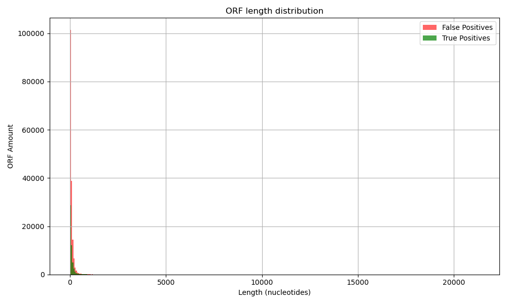

# ORF Detection in a Partial Human Transcriptome

## Project Overview

In this project we want to identify and validate Open Reading Frames (ORFs) in a partial human transcriptome assembly. Using Python and BLAST+, we detected ORFs, validated them against the SwissProt database, and performed a basic analysis of their properties and distributions.

All the analysis is executed inside a Docker container to ensure reproducibility and isolation from host dependencies.

---

## Data

- `Homo_sapiens_cdna_assembed.fasta` : partial cDNA transcriptome file 
- ORFs detected and saved in :
  - `orfs.fasta` (multi-fasta of sequences)
  - `orfs.gff` (locations and metadata)
- BLAST+ ran against SwissProt to validate ORFs (`blast_results.tsv`)

---

## Framework

1. **ORF Detection**  
   Scanned the cDNA sequences for ORFs using start (`ATG`) and stop codons (`TAA`, `TAG`, `TGA`). Overlapping and nested ORFs were ignored

2. **BLAST Validation**  
   BLASTed each ORF against SwissProt (human entries only, taxid: 9606) to identify coding sequences

   command used: blastx -db /home/max/data-mining/orf/dockerfiles/blast/v2.16.0/swissprot \
       -query /home/max/data-mining/orf/output/orfs.fasta \
       -taxids 9606 \
       -evalue 1e-5 \
       -outfmt 7 \
       -num_threads 4 \
       -out /home/max/data-mining/orf/output/blast_results.tsv

3. **Annotation Update**  
   GFF file updated with BLAST-based annotations (CDS vs UTR).

4. **Statistical Analysis**  
   - ORF length distribution
   - True vs false positives
   - Geometric distribution-based estimation

---

## Results Summary

Total ORFs detected : 221 920
ORFs validated by BLAST : 52 213
ORFs not validated : 169 707
Estimated mean ORF length : 64 nt

### ORF Length Distribution

A large number of false positives are short ORFs, likely resulting from random occurrences of start/stop codons in non-coding regions.



---

## Expected ORF Length (Theoretical)

Using a geometric distribution model:

- Probability of encountering a stop codon:  
  \( p = \frac{3}{64} \approx 0.0469 \)
- Expected number of codons until stop:  
  \( E[X] = \frac{1}{p} \approx 21.33 \) codons  
- Therefore, the expected ORF length is roughly 64 nucleotides

This aligns well with the observed peak of false positives.

---

## Files 

- `orf_detection.py` – ORF finder script
- `orf_validation.py` – BLAST parser and GFF updater
- `orf_analysis.py` – Histogram + geometric model
- `orfs.gff`, `orfs_validated.gff`, `orfs.fasta`, `blast_results.tsv` – Output files
- `Dockerfile` – Complete environment
- `README.md` – This

---

## Discussion

While many ORFs were detected, a large portion are likely non-functional due to short length and absence of BLAST hits. This reflects the high false positive rate inherent in naïve ORF detection. Incorporating transcript expression levels or conservation data could improve specificity.

Nevertheless, most true coding sequences were successfully identified and match SwissProt annotations, validating the pipeline's utility.

---

## Docker Usage

To reproduce the analysis in a containerized environment:


Run this where the dockerfile is located at:
docker build -t blast:v2.16.0 .

Run this at the roof of the project (change the path accordingly I was using WSL because i'm built different):
docker run -it --rm -v /home/max/data-mining/orf:/analysis blast:v2.16.0 bash

```bash
